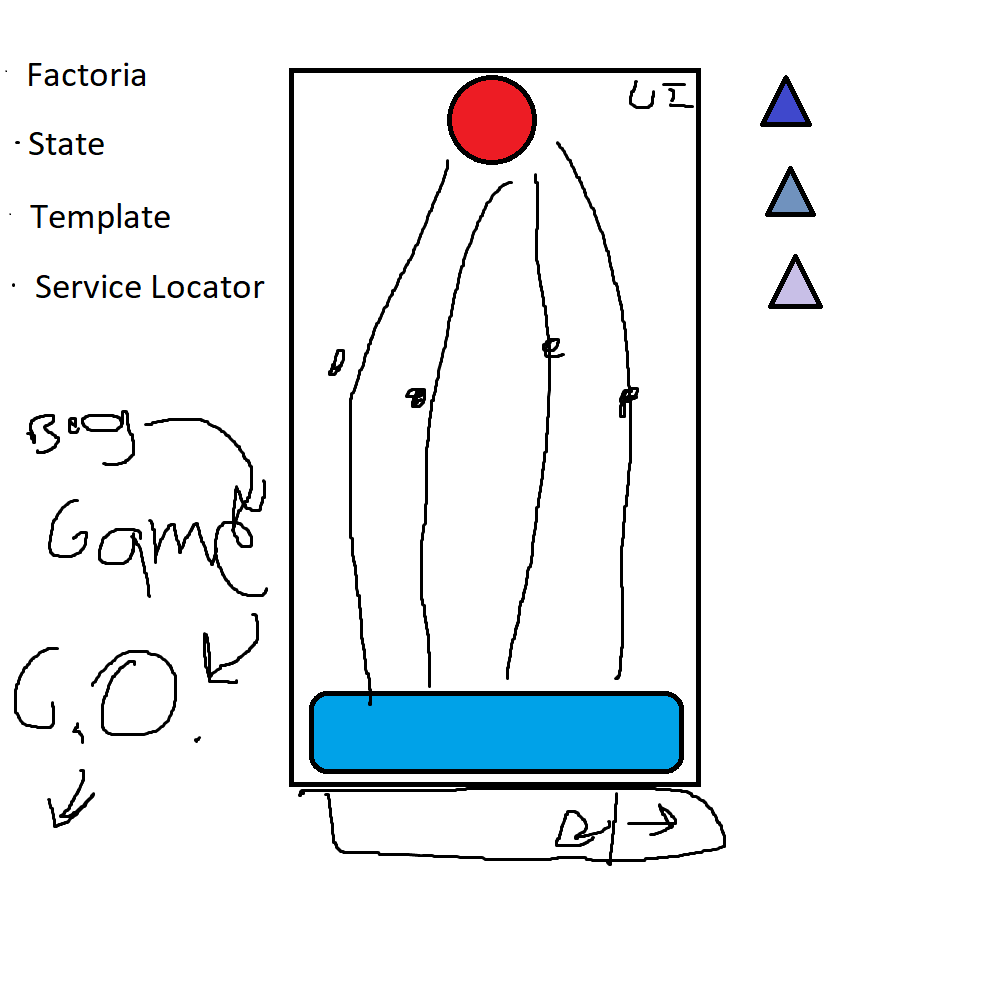

# Patrones de diseño para videojuegos [ES]

Repositorio con un juego sencillo donde lo importante son las mecánicas, y cómo las implementamos usando patrones de diseño.

Intentaremos ir añadiendo cosas con el tiempo, para poder ver más de cerca cómo implementar patrones y combinarlos.

    ServiceLocator: Implementado para la comunicación entre la UI, el enemigo y el jugador para indicar tanto la vida como los puntos del jugador.

______

    Template: Implementado para definir el mismo comportamiento para todos los enemigos, con la posibilidad de que algunos puedan implementar su propio comportamiento.

___

    Fábrica: Implementado para definir una única forma de instanciación de enemigos. Aumentar la cantidad de enemigos que se pueden usar, o incluso modificar las probabilidades de que aparezca uno sobre otro.

___

    Estado: Patrón implementado con [TeaTime]() para facilitar el aprovechamiento de cosas ya hechas.

### Resumen del juego

El juego es del género tower defense, donde debemos defender nuestra base de los enemigos, estos enemigos pueden moverse con diferentes velocidades. Hacer diferentes daños. Y dar puntos según sea necesario.

Podemos eliminarlos haciendo click en la pantalla para evitar que lleguen a nuestra base.

## Enlaces

- Vídeo: [YouTube](https://www.youtube.com/watch?v=dQw4w9WgXcQ)
- Juego: [Itch.io](https://peryloth.itch.io/design-patterns-for-videogames)
- Recursos: 

    [ThePowerUpsLerning - Blog](https://thepowerups-learning.com/)

    [ThePowerUpsLerning - Youtube](https://www.youtube.com/@ThepowerupsLearning)

    [Hora del té](https://github.com/luisplata/TeaTime)

# Design Pattern For Videogames [EN]

Repository with a simple game where the important thing is the mechanics, and how we implement them using design patterns.

We will try to keep adding things over time, so we can take a closer look at how to implement patterns and combine them.

    ServiceLocator: Implemented for communication between the UI, the enemy, and the player to indicate both the player's life and points.

______

    Template: Implemented to define the same behavior for all enemies, with the possibility that some can implement their own behavior.

___

    Factory: Implemented to define a single form of enemy instantiation. Increase the amount of enemies that can be used, or even modify the probabilities of appearing one over another.

___

    State: Pattern implemented with [TeaTime]() to make it easier to take advantage of things already done.

### Game summary

The game is of the tower defense genre, where we must defend our base from enemies, these enemies can move with different speeds. Do different damage. And give points as needed.

We can eliminate them by clicking on the screen to prevent them from reaching our base.

## Links

- Video: [YouTube](https://www.youtube.com/watch?v=dQw4w9WgXcQ)
- Game: [Itch.io](https://peryloth.itch.io/design-patterns-for-videogames)
- Resources: 

    [ThePowerUpsLerning - Blog](https://thepowerups-learning.com/)

    [ThePowerUpsLerning - Youtube](https://www.youtube.com/@ThepowerupsLearning)

    [TeaTime](https://github.com/luisplata/TeaTime)
